# 💰 LoanHub — Modern Financial Aggregator

**LoanHub** is a high-performance Android application designed to aggregate and streamline financial product applications (consumer loans, mortgages, auto loans, and leasing). Built with a focus on scalability, the project leverages a multi-module architecture and a robust Supabase-driven backend.

-----

## 📸 Interface Preview

### Core Experience

| **Loans List** | **Loan Details** | **Suggestions** |
|:---:|:---:|:---:|
| 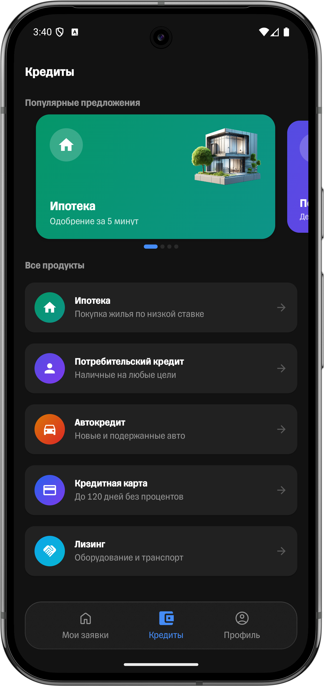 | 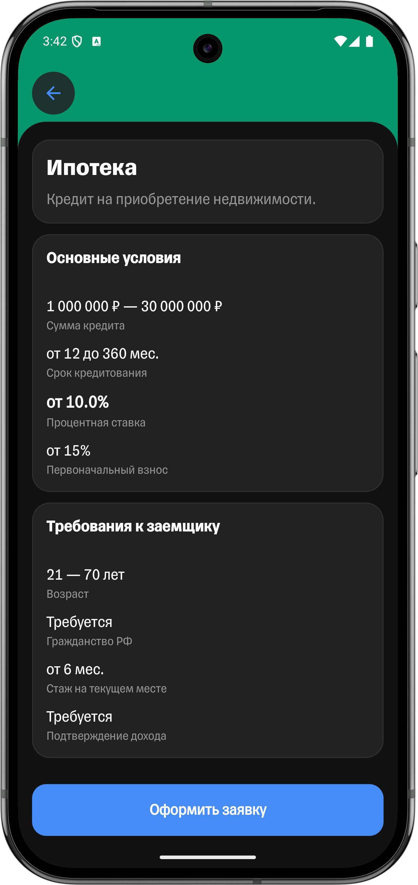 | 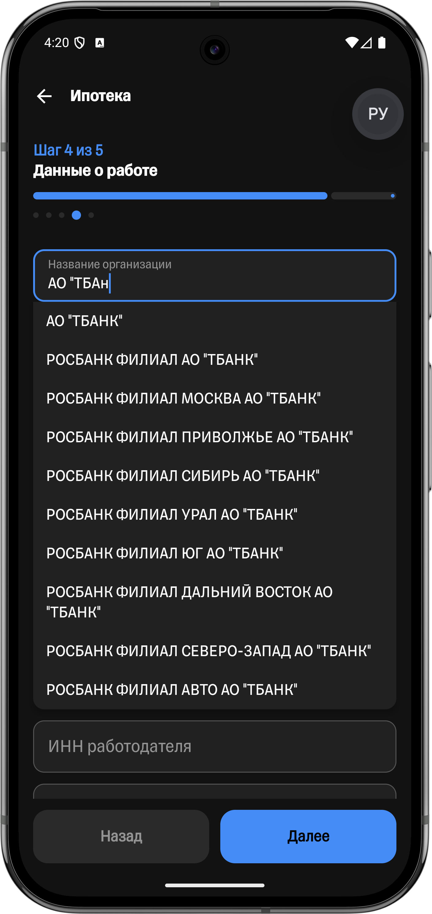 |

### User Profile & Data

| **Profile** | **Edit Profile** | **Smart Autofill** |
|:---:|:---:|:---:|
| 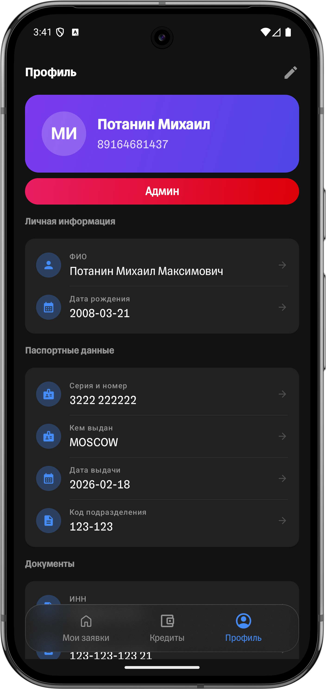 | 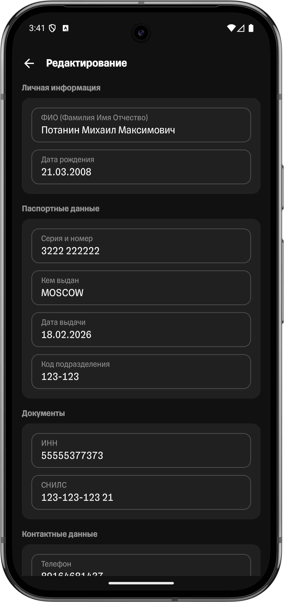 | 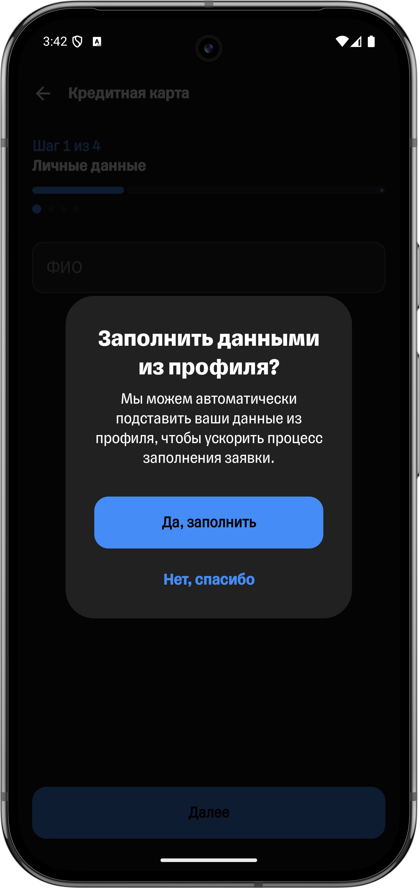 |

### Application Flow

| **Application (Pager)** | **Preview** | **Success State** |
|:---:|:---:|:---:|
| 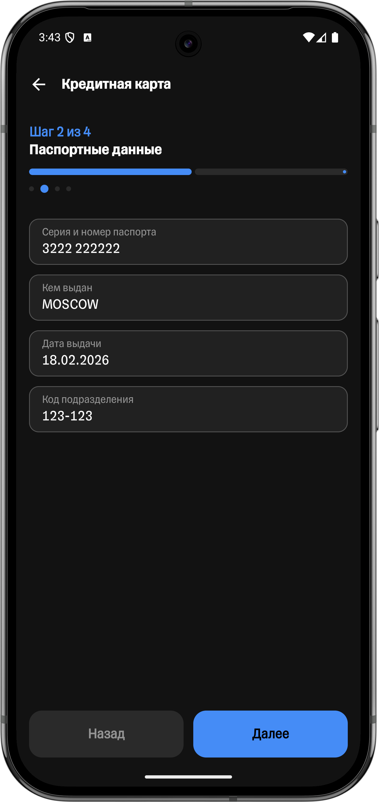 | 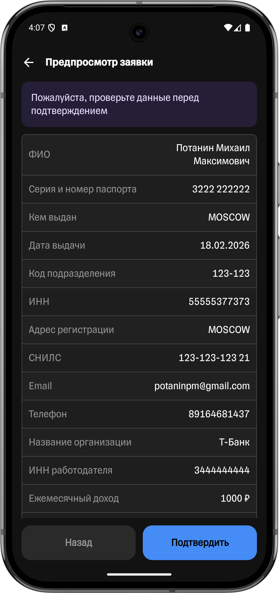 | 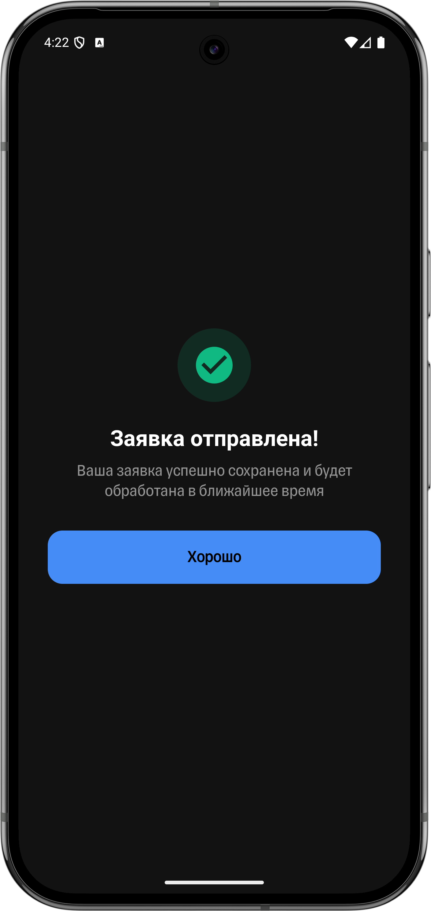 |

### Drafts & Data Management

| **Home with Drafts** | **Save to Draft** | **Export Dialog** |
|:---:|:---:|:---:|
| 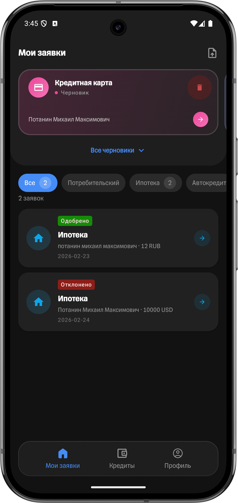 | 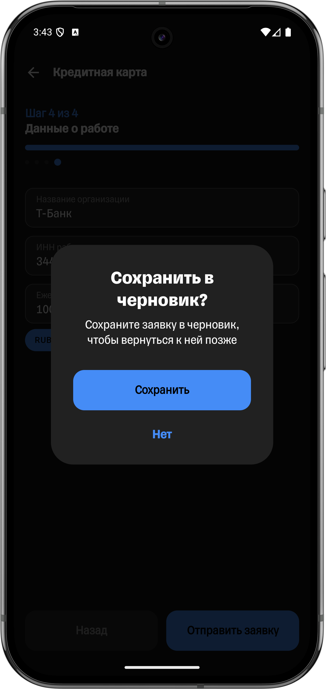 | 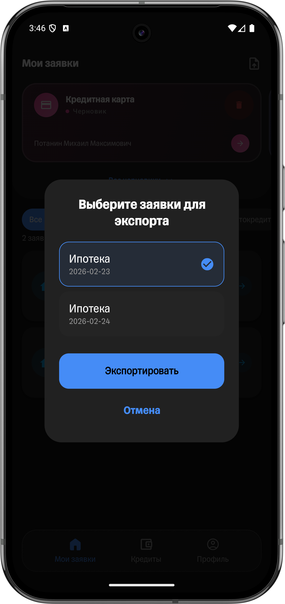 |

### Admin & Edge Cases

| **Admin Panel** | **Empty State** |
|:---:|:---:|
| 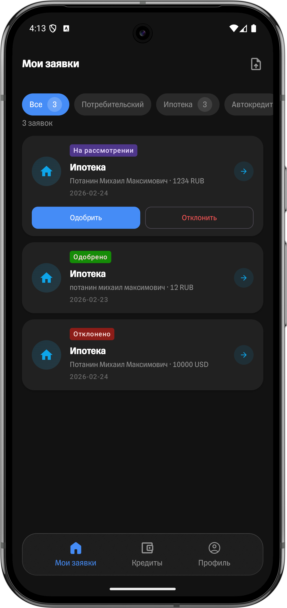 | 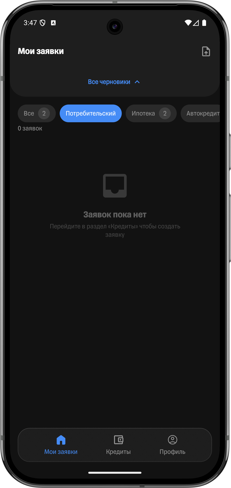 |

-----

## 🚀 Key Features

  * **Supabase Integration**: Real-time synchronization of loan types, user profiles, and application statuses with a PostgreSQL backend.
  * **Secure Authentication**: Advanced Auth system utilizing **Access/Refresh token** rotation for maximum security.
  * **Intelligent Admin Mode**: Built-in administrative interface to manage the application pipeline (Approve/Reject functionality).
  * **Smart Drafts**: Automatic background saving of incomplete applications, accessible directly from the home screen.
  * **Autofill Engine**: Intelligent data mapping that pulls verified user profile info into new applications to reduce friction.
  * **Leasing Module**: A dedicated financial product track with unique validation logic and specialized fields.
  * **BDUI (Backend Driven UI)**: Dynamic management of the loan list, including gradients, icons, and sorting order via Remote Config.
  * **Rich UI/UX**: Custom design system featuring glassmorphism effects (Haze), smooth shared-element transitions, and advanced shimmer skeletons for loading states.

-----

## 🛠 Tech Stack

  - **Language**: Kotlin
  - **UI Framework**: Jetpack Compose
  - **Architecture**: Clean Architecture + Multi-module (Manual DI)
  - **Backend**: Supabase (Auth, PostgreSQL)
  - **Networking**: Retrofit, OkHttp, Kotlin Serialization
  - **Local Storage**: Room Database (for Drafts and Caching)
  - **UI Effects**: Haze (Advanced Glassmorphism)
  - **Image Loading**: Coil
  - **Quality**: Detekt, Unit Tests, Robolectric (Component Tests)
  - **CI/CD**: GitLab CI

-----

## 📦 Project Structure

The project is strictly modularized to ensure separation of concerns and faster build times:

  - `:app` — The main entry point and dependency composition root.
  - `:sources:features` — Independent feature modules (Auth, LoanApplication, MyRequests, Profile, etc.).
  - `:sources:common` — Shared internal libraries (UI Kit, Networking, Database, DI).
  - `:sources:core` — Central navigation logic, Auth interceptors, and base utilities.

-----

## 🧪 Quality Assurance

  - **Static Analysis**: Run `./gradlew detekt` to check code quality.
  - **Testing**: Run `./gradlew test` to execute the full test suite.
  - **Automated CI**: Every Merge Request is automatically validated through the GitLab CI pipeline.

-----

## 🏗️ How to Build

1.  Clone the repository.
2.  Open in **Android Studio Ladybug+**.
3.  Build the project: `./gradlew assembleDebug`.

> **Tip**: For the best performance and to see the custom UI effects at their best, it is recommended to use the release build: `app/release/app-release.apk`.
